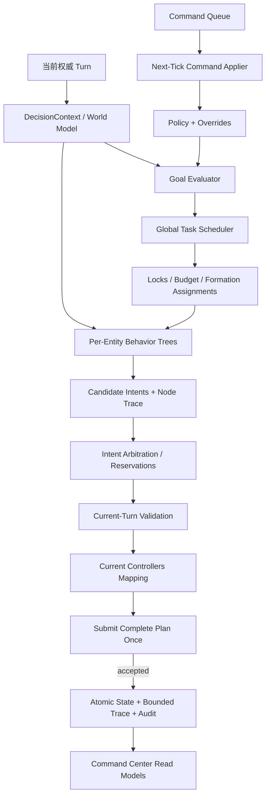

# Arena Hero 行为树、任务调度与作战指挥中心实施计划

> 日期：2026-08-09
> 状态：待评审，只包含架构与实施规划
> 推荐结论：采用“全局 Goal/Task Scheduler + 每实体 Behavior Tree + 统一 Intent Arbitration/Validation”的分层混合架构；旧 `StrategicMode` 仅作为迁移期观测标签，最终删除。

## 1. Goal、非目标与验收口径

### Goal

- 把“每 Tick 重选整体模式”改造成跨 Tick 持久、可解释、可抢占的 Goal/Task 系统。
- Core、Worker、Vanguard、Ranger 各自通过行为树执行已分配任务，并始终从当前权威 `Turn` 产生候选 `Intent`。
- 用统一仲裁、资源预算、位置预留与当前 Turn 校验保证每对象一个动作、一次完整提交、不可伪造对象/坐标/敌人。
- 实现资源、生产、恢复、防御、侦察、护航、Beacon、Core 迁移、攻击敌 Core 的协同调度。
- 把现有只读 Dashboard 升级为安全的指挥中心；HTTP 线程只写版本化命令队列，命令由下一 Tick 的 worker 消费。
- 保持同步 SDK、标准库服务、Docker 开发 bind mount，以及 `/livez`、`/healthz`、`/status` 兼容。

### 非目标

- 不重写官方 SDK、协议、WebSocket 或服务端结算；不做实时 Turn 的 HTTP 直接控制器调用。
- 不缓存旧 Turn Controller，不基于历史敌人生成攻击，不把历史资源当作可采集事实。
- 不在本次架构迁移中引入在线学习、随机策略、多人账号管理、云端托管或公网直连。
- 不主动生成 `SELF_DESTRUCT`；`DROP_BEACON` 只可在未来经过单独安全评审后开放。
- 不要求一次推倒重写；任何阶段都必须可切回旧 planner。

### 成功指标

1. 最近 100 Tick 中，同一资源/路线阻塞任务连续等待不超过默认 4 Tick；之后必须重规划、降级、转派或失败，并记录原因。
2. 单位任务在无事实变化时跨 Tick 保持同一 `task_id`、目标和树路径；不会因全局标签切换而无理由重置。
3. 高优先救援、防御、撤退和人工命令可在下一个权威 Tick 抢占，且留有审计与恢复点。
4. Beacon 流程可从侦察推进到拾取、持有、防守与丢失恢复；敌 Core 流程可从发现推进到集结、接战、撤退或击杀确认。
5. Core 能按多 Tick migration plan 向 Beacon/战略锚点逐格迁移，并协调 Worker 回收、存储窗口与失败恢复。
6. 20 个 Unit 的 p95 决策耗时小于 500ms，最坏降级仍在 900ms 内完成；不触及 15 秒服务窗口。
7. 每 Tick trace 能回答每个实体“正在做什么、目标、下一步、原因、树路径、任务状态、阻塞与等待 Tick”。
8. 命令 API 具备认证、CSRF、幂等、乐观并发、TTL、审计与 next-Tick 应用语义；重复请求不重复生效。

### 最终验收标准

- 所有新旧测试命令通过；代表性 100-Tick 离线回放不出现任务泄漏、重复动作、无界 trace 或旧 Controller 复用。
- shadow 模式连续至少 500 个回放 Tick：新 planner 生成完整合法计划，仲裁确定性一致，超预算率为 0。
- canary 切换后 `/status` 保持旧字段，健康端点语义不变；回滚开关无需数据回退即可恢复旧 planner。
- 指挥中心对每个当前 Core/Unit 展示完整决策链，写操作在下一 Tick 应用并可从 AuditEvent 追溯。

## 2. 当前架构问题与真实回放证据

当前调用链为 `AgentRuntime.decide -> choose_mode/propose_intents -> validate_intents -> apply_intents`。`arena_tactic/strategy.py` 约 1300 行，同时处理模式、资源匹配、探索、治疗预算、阵型、Beacon、生产与 Core 迁移；`AgentMemory.unit_tasks` 是无模式约束的字典，缺少任务 ID、状态机、优先级、期限、所有权、抢占与失败策略。`DecisionResult` 只解释最终动作，不解释未选 Goal、任务转移或树节点。Dashboard 只读取 JSONL 尾部并显示模式与动作计数。

最近 100 个有效回合（Tick `79773–79872`，对象仅用短标识）显示：

| 证据 | 观察 | 架构含义 |
| --- | --- | --- |
| 提交/性能 | 100/100 accepted，0 timeout，平均 23.53ms，最大 44.36ms | 有充足预算引入有界调度与 trace；问题不是算力不足 |
| 整体模式 | `ECONOMY` 85 Tick，`DEFEND` 15 Tick | 单一模式无法表达“局部救援 + 防守 + 侦察 + 生产”并行 |
| 卡死 Worker | `f6cd9a…` 在同一格 100 Tick，全部 `WAIT/resource_route_blocked` | 无任务等待上限、重试状态、转派或危险资源放弃机制 |
| Core | 位置 100 Tick 不变；100 次 `WAIT/resources_reserved_or_no_legal_core_action` | Core 迁移只是低优先机会分支，没有长期迁移目标 |
| 资源/生产 | 资源始终 9，人口始终 5；100 Tick 只有 MOVE/WAIT | 固定保留规则与单动作分支形成长期停滞，缺少全局预算任务 |
| 战斗协同 | 敌人每 Tick 可见；Vanguard 各有 72 Tick 守圈等待；最远 Worker 距 Core 59 格 | 防御围绕 Core 局部响应，不会形成远程救援/护航任务 |
| Beacon | 0 个己方持有 Tick，未进入完整 Beacon 生命周期 | Beacon 是模式分支而非可分解、可恢复的长期 Goal |

这些证据作为回归夹具固化，但计划文件与 UI 不保存完整 UUID。

## 3. 三种架构比较与明确推荐

| 维度 | 纯行为树 | 纯任务/作业调度器 | 分层混合（推荐） |
| --- | --- | --- | --- |
| 跨 Tick 持久性 | Blackboard 可实现，但任务生命周期容易隐含在节点状态 | 原生强，Task/Assignment 可持久化 | Goal/Task 显式持久，BT 仅保留执行游标 |
| 抢占/中断 | Reactive Selector 擅长局部抢占，跨单位原因不直观 | 擅长优先级、租约与抢占，局部反应会膨胀为 job 状态 | Scheduler 决定“做什么”，BT 决定“本 Tick 怎么做” |
| 全局资源冲突 | 黑板锁容易分散在树节点 | 锁、预算、依赖天然清晰 | Scheduler 预分配，Arbitrator 最终统一裁决 |
| Beacon/Core/战斗协调 | 单棵全局树过大，多实体树缺中央编队语义 | 编队强，但动作细节与即时生存规则笨重 | Goal 分解编队任务，各实体树处理即时条件 |
| 可解释性 | 节点路径很好，但“为何分配此任务”较弱 | 任务时间线好，但动作选择理由较弱 | 同时展示 Goal→Task→Assignment→BT path→Intent |
| 后台指挥 | 改黑板/节点参数风险高 | 命令映射任务/Override 自然 | Command 形成 Policy/Override/Task，安全且可审计 |
| 测试难度 | 树结构、节点状态与全局交互耦合 | 调度状态组合多，实体策略散落 | 可分别测试纯调度、纯节点、仲裁和端到端回放 |
| 渐进迁移 | 容易需要重写 `strategy.py` | 能包旧 planner，但实体逻辑难复用 | 先包旧 Intent，再逐实体/目标替换，风险最低 |

**推荐分层混合架构。** 不选纯行为树，因为全局资源、单位锁、编队和人工指挥会被迫塞进共享 Blackboard，树退化成隐式调度器；不选纯任务调度器，因为每 Tick 的治疗、射线、相邻横扫、动态路线与紧急撤退会产生大量细碎 job 状态，局部反应和解释路径反而更差。



## 4. 核心领域模型、状态与生命周期

所有 ID 在进程内可用 UUID；持久化和 Dashboard 使用不可逆短别名。模型优先采用 `dataclass(frozen=True, slots=True)` 与 `StrEnum`，不把 SDK Controller 放入任何持久对象。

| 模型 | 关键字段 |
| --- | --- |
| `Goal` | `goal_id, kind, source(AUTO/MANUAL), status, priority, utility, target_ref/cell, created_tick, deadline_tick, ttl_ticks, parent_id, dependencies, policy_version, reason_codes, progress` |
| `Task` | `task_id, goal_id, kind, status, priority, required_roles, min/max_units, target, preconditions, success/failure predicates, retry_policy, ttl, wait_budget, formation_id` |
| `TaskAssignment` | `assignment_id, task_id, actor_alias/runtime_id, role, status, lease_until_tick, assigned_tick, started_tick, waiting_since, preemptible, checkpoint, last_blocker` |
| `BehaviorTree` | `tree_id, entity_kind, schema_version, root_node_id, compatible_task_kinds` |
| `Node` | `node_id, kind(Selector/Sequence/Condition/Action/Decorator), children, parameters, status, entered_tick, visits, last_reason`；定义只读，运行状态进 Blackboard |
| `Blackboard` | `tick, assignment, target_snapshot, route_cursor, retry_count, cooldowns, formation_slot, observed_facts, node_memory`；不保存 Controller |
| `Intent` | 延续 `ActionIntent` 并增加 `intent_id, task_id, node_id, class(safety/manual/task/idle), priority, utility, valid_for_tick, resource_claims, lock_claims, explanation` |
| `Command` | `command_id, idempotency_key, type, payload, expected_version, issued_at, not_before_tick, expires_at_tick, status, issuer, apply_result` |
| `Policy` | `version, posture, weights, thresholds, safety_limits, planner_feature_flags, effective_tick` |
| `Override` | `override_id, scope(global/entity/task), command_id, priority, mode, task_spec/policy_patch, created_tick, ttl, status` |
| `AuditEvent` | `event_id, wall_time, tick, actor, operation, subject_alias, before_version, after_version, outcome, reason, request_hash` |

状态机：

- Goal：`PROPOSED -> ACTIVE -> SATISFIED | FAILED | CANCELLED | EXPIRED`；可 `ACTIVE <-> SUSPENDED`。
- Task：`PENDING -> READY -> ASSIGNED -> RUNNING -> SUCCEEDED | FAILED | CANCELLED | EXPIRED`；阻塞用 `BLOCKED`，条件恢复回 `READY/RUNNING`。
- Assignment：`OFFERED -> ACCEPTED -> RUNNING -> COMPLETED`；抢占为 `PREEMPTING -> PREEMPTED`，失去实体为 `ORPHANED`。
- Command：`QUEUED -> APPLIED | REJECTED | EXPIRED | SUPERSEDED | CANCELLED`；只允许队列侧取消尚未应用命令。
- BT 节点每 Tick 返回 `RUNNING/SUCCESS/FAILURE`；`RUNNING` 游标跨 Tick 保留，事实变化、租约丢失或高优先任务触发 `halt()` 并写 checkpoint。

持久化顺序：收到 Turn → 加载快照 → 应用命令 → 调度/执行/仲裁 → submit → 仅 accepted 后原子提交下一状态、trace 索引与命令结果。提交失败不提前推进任务。

## 5. 全局 Goal 与任务调度

### 优先级与效用

硬优先级层：`LIFECYCLE(1000) > EMERGENCY_STOP(950) > SURVIVAL/RETREAT(900) > CORE_DEFENSE(850) > MANUAL_FORCE(800) > BEACON_HOLD/CORE_ATTACK(650–780) > RECOVERY/ESCORT(600) > ECONOMY/PRODUCTION(400–550) > SCOUT(250) > IDLE(0)`。同层用效用：

```text
utility = base_value + command_boost + urgency + strategic_progress
        + starvation_age + role_affinity + completion_bonus
        - path_cost - threat_risk - resource_cost - switch_cost
        - opportunity_cost - uncertainty
```

数值只用于同一硬安全层内排序。`starvation_age` 有上限，不能越过安全层。

### 调度规则

- Goal Evaluator 可同时保持多个 ACTIVE Goal，不再选唯一全局模式；`posture` 只调整权重和安全阈值。
- Task 显式依赖，例如 `PICKUP_BEACON` 依赖 `SCOUT_ROUTE`、`SELECT_CARRIER`、最低护航战力；攻击任务依赖目标当前可见或“重新获取视野”。
- 锁分为实体独占锁、目标容量锁、资源预算锁、Core 动作锁、编队槽位锁。先按 `(priority, utility, age, stable_id)` 排序，再二阶段分配；Arbitrator 仍做最终容量预留。
- Assignment 用 Tick 租约；每 Tick续租。实体死亡/重生、新命令、目标失效时释放。不得把实体 UUID 当作跨重生身份。
- 抢占只发生于更高安全层、人工强制命令或效用超过 `preemption_margin`；记录旧任务 checkpoint 和 `preempted_by`，避免抖动。
- 默认 TTL：即时撤退 3 Tick、单步移动 4、资源采集任务 12、护航 20、侦察 24、Beacon/攻击 Goal 60 并按进展续期、人工命令由请求显式指定且上限 120。
- 失败重试采用 `max_attempts + next_retry_tick + blocker fingerprint`；同一 blocker 默认 4 Tick 后转派/绕行，地形失败永久记障碍，动态占用指数退避 1/2/4 Tick。
- 饥饿避免：等待每 Tick 加 age，连续两次被低层任务抢占后增加 switch cost；至少保留一个 Worker 执行经济任务，除非生存或人工全局命令覆盖。
- 编队用 `FormationTask` 管理 leader、rally cell、slots、cohesion radius、ready quorum、straggler policy；子 Assignment 独立执行，可替补死亡成员。

## 6. 每实体行为树

BT 引擎自研最小同步实现：Composite、Decorator、Condition、Action、稳定节点 ID、halt、trace；节点不得直接调用 SDK，只返回 Intent 或状态。

```text
Core Root Selector
├─ Sequence [Condition MissingCore, Action NoIntent]
├─ Sequence [Condition EmergencyHalt, Action ExplicitWait]
├─ Sequence [Condition CriticalSurvival, Selector Heal / Repair / Wait]
├─ Sequence [Condition AssignedMigration, Selector ContinueMovement / CancelUnsafe / StartNextLeg]
├─ Sequence [Condition AssignedBeacon, Selector Pickup / HoldSupport]
├─ Sequence [Condition AssignedProduction, Action SpawnWithinBudget]
└─ Action WaitWithReason

Worker Root Selector
├─ Sequence [Condition Emergency, Selector DepositNow / Retreat / Evade]
├─ Sequence [Condition Cargo, Selector Deposit / FollowCoreDestination / Return]
├─ Sequence [Condition AssignedRescueOrEscort, Action MoveFormationSlot]
├─ Sequence [Condition AssignedResource, Selector HarvestVisible / Move / ReplanBlocked]
├─ Sequence [Condition AssignedScout, Action AdvanceFrontier]
└─ Action RequestTaskAndWait

Vanguard Root Selector
├─ Sequence [Condition LethalRiskAndNotDecisive, Action Retreat]
├─ Sequence [Condition AdjacentHighValueTarget, Action Sweep]
├─ Sequence [Condition AssignedRescue, Selector Intercept / Screen / EscortHome]
├─ Sequence [Condition AssignedBeaconOrAttackFormation, Action HoldOrAdvanceSlot]
├─ Sequence [Condition AssignedDefense, Action InterceptThreat]
└─ Action GuardWithLease

Ranger Root Selector
├─ Sequence [Condition LethalRiskAndNotDecisive, Action Retreat]
├─ Sequence [Condition LegalDecisiveShot, Action Shoot]
├─ Sequence [Condition AssignedFireMission, Selector ShootCell / RepositionLine / Hold]
├─ Sequence [Condition AssignedEscortOrDefense, Action MaintainStandoff]
├─ Sequence [Condition AssignedScout, Action AdvanceFrontier]
└─ Action GuardWithLease
```

Selector 返回首个非 Failure 子节点；Sequence 遇 Failure 停止、遇 Running 保存游标；Condition 无副作用；Action 只提候选 Intent；Decorator 包括 `TimeoutTicks`、`Retry`、`Cooldown`、`UntilSuccess`、`AbortIf`、`Trace`。所有树先执行硬安全分支，再执行 Assignment 分支。

## 7. Beacon 完整作战流程

1. `CONTROL_BEACON` Goal 根据 Beacon 距离/状态可见性、己方战力、敌压、Core 健康与策略权重产生。
2. `SCOUT_BEACON_CORRIDOR`：Ranger/Worker 建立走廊当前可见事实；Beacon 坐标虽始终公开，但 carrier 状态只按当前视野解释。
3. `SELECT_CARRIER`：默认满血 Vanguard；次选 Ranger；Worker 仅在低威胁且资源任务可替代时；Core 只在同格且无迁移风险时兜底。
4. 创建编队：carrier、前卫屏障、远程火力、后卫/接应；保留至少一名经济 Worker。
5. `SECURE_ROUTE` 和 `ESCORT_CARRIER` 达到 ready quorum 后推进；carrier 不单独脱离 cohesion radius。
6. 并行建立 `MIGRATE_CORE_TOWARD_BEACON`，逐格选择可通行、非资源、风险低且有接应空间的锚点；迁移不等待 carrier 到达才开始，但不得破坏存储与恢复窗口。
7. 当前 Turn 确认 GROUND 且同格才 `PICKUP_BEACON`；多己方候选只授权一个，避免 UUID 竞态。
8. 拾取后转 `HOLD_BEACON`：carrier 在防御锚点活动，Core 修盾目标上调至 10，护卫轮换治疗，Worker 利用采集加成但不让 carrier 承担普通采集。
9. Beacon 丢失/载体消失：以新 Turn 和事件确认落点，旧 Assignment 全部中止，建立 `RECOVER_BEACON`；不可在同 Tick 假设重新拾取。
10. 完成指标：持有 Tick、护卫存活、Core-Beacon 距离、资源净增；不是“一次 pickup 即成功”。

## 8. 攻击敌方 Core 完整流程

1. `DISCOVER_ENEMY_CORE` 只由当前可见 Core 建立 target snapshot；失去视野后转 `REACQUIRE_TARGET`，不得按历史 UUID 发攻击。
2. 战力评估包含己方有效 HP、Vanguard 邻接到达时间、Ranger 合法射线/阵位、敌方可见护卫、己 Core 当前风险、撤退路径与资源容量风险。
3. 达到阈值后创建 `ATTACK_ENEMY_CORE` Goal 与 rally formation；不足则监视、增产或撤销，不让单位逐个冲锋。
4. `ASSEMBLE`：Vanguard 前排、Ranger 距目标 2–3 格射击槽、Worker 默认不参战；只有人工命令或救回关键 Beacon/货物且风险可接受时 Worker 才参与支援。
5. `ROUTE_TO_CONTACT` 每 Tick重验障碍、占用、目标可见性和队形；落后者超时则跟随、替补或脱离，不拖死主队。
6. `ENGAGE`：Ranger 优先合法 Core 射击；若预测移动则可用 cell shot，但必须受任务策略与当前坐标约束。Vanguard 相邻时对 Core 所在格横扫并计入同格敌军价值。
7. 每 Tick计算继续/撤退效用；触发条件含兵力低于 quorum、己 Core 高压、关键 carrier 危急、目标失视超 TTL、无安全撤退线。
8. 撤退任务优先于普通攻击，按集结点/己 Core/临时安全点分层回撤并安排 Ranger 掩护。
9. 仅以 `CORE_DESTROYED`、目标从当前事实消失并伴随相关结算事件确认击杀；资源捕获按 `CORE_RESOURCES_CAPTURED` 权威结果入账，不能按参与推断。

## 9. Core 迁移规划

- `CoreMigrationPlan` 字段：`plan_id, goal_id, strategic_destination, legs[], current_leg, started_tick, expected_finish_tick, safety_score, abort_policy, worker_recall_task_ids, storage_checkpoint`。
- 目的地评分优先：缩短到 Beacon/集结点距离、当前/记忆障碍可行、敌威胁低、周边两格容量、可形成防守圈、Worker 回收成本、资源格禁入、后续腿可达。
- 每腿是相邻一格且预计 4 Tick。`START_MOVE` 后从当前 Turn 的 `move_progress/destination` 追踪；不重复启动。若方向需变更，只在人工取消或安全规则明确触发时 `CANCEL_MOVE`。
- 迁移前建立 `RECALL_CARGO_WORKERS`：有货 Worker 优先在 Core 仍 NORMAL 时存入；无法及时回收者改往公开 destination 接应。迁移中 Core 不生产、不治疗、不修盾、不接收存入，调度器冻结这些 Core 任务并解释预计恢复 Tick。
- 存储始终使用 `max(10, population*5)`；迁移前避免高风险牺牲导致溢出，生产采用 SDK `unit_cost()` 预览并让服务端事件校准实际成本。
- 第四 Tick 失败后读取原因：地形升级永久障碍；占用/争夺动态退避；重算当前腿，必要时回到上一个安全锚点。Core 消失则整个 plan `ORPHANED`，等待新 Core 后从战略 Goal 重新生成，绝不沿用旧 ID。

## 10. 作战指挥中心产品设计

### 信息架构

- **总览**：连接/提交、当前 Tick、全局 Goal、姿态、资源与容量、Beacon、Core 迁移、告警。
- **战术地图**：己方实体、当前可见敌人/资源、永久障碍、Beacon、任务路线、编队槽与风险热区；历史事实使用虚线/低透明度并标注最后观察 Tick。
- **实体列表/卡片**：短标识、类型/HP/货物、当前任务、目标、下一步、原因、BT path、状态、阻塞、等待/预计 Tick；支持筛选与选中地图对象。
- **任务面板**：Goal 树、任务队列、依赖、锁、优先级、TTL、进度、抢占关系、时间线。
- **行为树检查器**：当前执行路径高亮，显示 Running/Success/Failure、节点耗时和失败原因；默认只展示所选实体。
- **命令面板**：姿态与策略参数、单位任务下达/暂停/恢复/取消、Core 迁移、Beacon 优先级、攻击/护航/撤退、紧急停机与恢复自动控制；危险命令二次确认。
- **告警与审计**：卡死任务、反复移动失败、Core 迁移失败、命令冲突/过期、规划超预算、认证失败；可按 Tick/命令/实体追溯。

### 前端取舍与推荐

| 方案 | 优点 | 代价 |
| --- | --- | --- |
| 无框架：模块化 ES Modules + Web Components/SVG | 保持单 Python 进程、无 Node 运行依赖、源码修改后 restart、部署与 CSP 简单 | 状态管理与复杂树/地图组件需自建 |
| 引入 React/Vue/Svelte 构建产物 | 复杂交互、组件生态和测试体验更好 | 增加 Node 构建链、镜像依赖与静态产物管理；偏离当前薄服务 |

推荐第一版无框架，拆分 `arena_tactic/web/static/*.js/css`，用 SVG 实现地图/树；接口与组件边界稳定后，若实体规模与交互复杂度证明必要，再以独立 ADR 迁移到框架。不得使用 CDN。

## 11. Command API 与安全边界

### Endpoint

- `POST /api/v1/session`：凭管理员口令换取 `HttpOnly; SameSite=Strict; Secure(有 TLS 时)` 会话及 CSRF token。
- `GET /api/v1/snapshot`、`GET /api/v1/entities/{alias}`、`GET /api/v1/tasks`、`GET /api/v1/audit?cursor=`。
- `GET /api/v1/policy`；`PATCH /api/v1/policy`。
- `POST /api/v1/commands`；`GET /api/v1/commands/{command_id}`；`DELETE /api/v1/commands/{command_id}` 仅取消 QUEUED。
- 便捷路由仍转成 Command：`POST /api/v1/entities/{alias}/tasks`、`POST .../pause|resume|cancel`、`POST /api/v1/core/migrations`、`POST /api/v1/control/emergency-stop|resume-auto`。

请求示例（标识截断）：

```json
{
  "type": "ASSIGN_TASK",
  "idempotency_key": "ui-20260809-000184",
  "expected_command_version": 17,
  "not_before_tick": 79873,
  "ttl_ticks": 12,
  "payload": {
    "entity_alias": "f6cd9a…",
    "task_kind": "RETREAT_TO_CORE",
    "priority": 820,
    "target": {"kind": "OWN_CORE"}
  }
}
```

```json
{
  "command_id": "cmd_0184",
  "status": "QUEUED",
  "command_version": 18,
  "accepted_at_tick": 79872,
  "effective_not_before_tick": 79873,
  "expires_at_tick": 79884
}
```

- `Idempotency-Key` 8–128 可见 ASCII，服务保存请求体哈希；同键同体返回原响应，异体 `409`。
- 所有写请求带 `If-Match: "command-version-17"`，版本不符 `409 VERSION_CONFLICT` 并返回当前版本。
- HTTP 线程只做认证、schema/alias/范围校验与原子追加队列；不持有 Turn，不调用 Controller，不改变 planner 内存。
- worker 在每个新 Turn、构造 DecisionContext 后一次性读取队列快照，按 `not_before_tick/TTL/version` 应用；结果在 accepted 后提交。过期为 `EXPIRED`，对象已死亡为 `REJECTED/ENTITY_NOT_CURRENT`，被新命令取代为 `SUPERSEDED`。
- 紧急停机解释为 `EmergencyHalt Override`：下一 Tick 为所有当前对象生成显式安全 WAIT，服务仍连接、提交和观测；恢复自动控制创建更高版本命令撤销该 Override。
- 默认只绑定 `127.0.0.1`。局域网必须显式开启 `ARENA_HERO_COMMAND_LAN=1`、配置强随机管理员口令/其哈希并限制允许 Origin/Host；公网必须经 TLS 认证反代，应用不自行实现 TLS。
- Cookie 会话必须配合 CSRF token + 严格 Origin/Host 校验；登录/写操作限速，固定时长会话，失败不泄露目标是否存在。GET 不改变状态。
- Policy 参数采用 allowlist、类型/上下界、版本和生效 Tick；不能通过 API 关闭当前 Turn 校验、单动作限制、敏感信息脱敏或规划硬预算。

## 12. 可观测数据模型与有界持久化

新增 `DecisionTrace`：`schema_version, tick, planner_version, policy_version, goal_summaries, task_transitions, entity_traces, arbitration, validation, command_results, timings, truncation`。每个 `EntityTrace` 包含短别名、task/assignment、current/target/next、reason codes、BT node path（节点 ID、状态、耗时）、blocker、waited_ticks、eta_ticks、候选/胜出 Intent。

- `runtime/replay.jsonl` 保持 v1 兼容；新增 `runtime/decision-trace.jsonl`（v1）和 `runtime/audit.jsonl`（v1）。Dashboard 通过 allowlist read model 读取，不直接透传文件。
- 每 Tick trace 默认上限 64KB、每实体 64 个节点事件、总 2048 节点事件；超限按“失败/阻塞/胜出路径优先”截断并设置标志。
- worker 只把已序列化事件放入有界内存队列（默认 256）；单独 writer 线程批量追加、周期 flush。队列满时丢弃低优先节点明细而非阻塞提交，保留 Tick 摘要与 drop counter。
- 按文件大小轮转：trace 32MB×4、audit 16MB×8、replay 沿用并新增 64MB×4；使用同目录 rename，启动时容忍末行截断。
- Dashboard 单请求最多 256KB 文件尾、50 Tick、200 实体摘要、1000 审计项分页；1 秒缓存，响应目标小于 512KB。

## 13. 精确文件拆分与现有模块迁移

### 新增建议

```text
arena_tactic/domain/{goals,tasks,assignments,commands,policy,trace}.py
arena_tactic/scheduler/{goal_evaluator,utility,locks,formations,scheduler}.py
arena_tactic/behavior_tree/{core,node,runner,blackboard,decorators}.py
arena_tactic/behaviors/{common,core,worker,vanguard,ranger}.py
arena_tactic/objectives/{beacon,core_attack,core_migration,rescue,economy}.py
arena_tactic/planning/{pipeline,arbitration,budgets}.py
arena_tactic/command/{models,queue,applier,auth,audit}.py
arena_tactic/web/{api,projections}.py
arena_tactic/web/static/{index.html,app.js,store.js,map.js,tree.js,tasks.js,commands.js,styles.css}
tests/{test_domain_models,test_scheduler,test_behavior_tree_engine,test_entity_trees}.py
tests/{test_beacon_campaign,test_core_attack_campaign,test_core_migration_plan}.py
tests/{test_command_api,test_command_application,test_command_security,test_decision_trace}.py
tests/fixtures/replay_recent_100_sanitized.jsonl
```

### 现有文件

- `arena_tactic/strategy.py`：Phase 1 先作为 `LegacyPlannerAdapter` 输出旧 Intent；随后把资源/探索、战斗、Beacon、Core 逻辑逐段迁出。禁止继续新增业务分支。最终删除 `choose_mode/propose_intents`，保留必要评分函数到目标模块。
- `arena_tactic/runtime.py`：演进为薄 pipeline orchestrator：context → command apply → goal/schedule → BT → arbitration → validation → allocation；持久化仍只在 accepted 后 commit。
- `arena_tactic/memory.py`：`MEMORY_VERSION` 升级，拆出 `AgentState`（地图事实、Goal/Task/Assignment、BT state、Policy version、命令游标）；提供 v1/v2 只读迁移器和安全回退。
- `arena_tactic/dashboard.py`：先保留 v1 projection，之后 HTML 移到 static，新增只读 projection；写 API/auth/queue 不混入投影逻辑。
- `tactic.py`：继续只承担 SDK loop、一次 submit、健康端口和重连；HTTP handler 委托 `web.api`，通过线程安全队列与 worker 通信，不引入 Web 框架。
- `models.py`：只保留动作/基础公共类型；战略领域模型移至 `domain/`，`StrategicMode` 先标 deprecated 后删除。
- `observability.py`：保留 replay v1，新增异步有界 trace/audit writer 与 schema migration。
- `validation.py`、`allocator.py`、`navigation.py`：保留为统一最后边界；扩充命令不可绕过、预算和 cell-shot 支持，不下沉到 BT 节点。

## 14. 渐进实施阶段、TDD、验证与提交边界

每阶段先写失败测试，再最小实现，再跑阶段命令；这里的“提交”仅是未来实施建议，本计划阶段不提交。

### Phase 1：领域模型与 trace（可独立上线，行为不变）

- 新增上述 `domain/*`、`test_domain_models.py`、`test_decision_trace.py`；代表失败测试：`test_task_lifecycle_rejects_illegal_transition`、`test_trace_explains_each_current_entity`、`test_trace_truncates_without_blocking`。
- 用 `LegacyPlannerAdapter` 生成新 trace，实际动作仍来自旧 strategy；状态文件支持 v3 双读/v2 回退。
- 命令：`python3 -m pytest -q tests/test_domain_models.py tests/test_decision_trace.py tests/test_runtime_replay.py`；预期全绿且相同夹具的 SDK plan 不变。
- 回滚：关闭 `trace_v1`；提交建议：`feat(domain): add persistent task models and bounded decision trace`。

### Phase 2：全局调度器（shadow）

- 新增 scheduler、`test_scheduler.py`；测试：`test_high_priority_rescue_preempts_guard`、`test_lock_prevents_double_resource_assignment`、`test_blocked_task_ages_then_reassigns`、`test_scheduler_is_deterministic`。
- shadow 生成 Goal/Task/Assignment 但不驱动动作；对近期 100 Tick 生成差异报告。
- 命令：`python3 -m pytest -q tests/test_scheduler.py tests/test_replay_scenarios.py`；预期无锁冲突、同输入同调度。
- 回滚：关闭 `scheduler_shadow`；提交：`feat(scheduler): add deterministic goal and task allocation`。

### Phase 3：实体行为树

- 新增 BT engine、四类树及测试；测试：`test_running_node_resumes_next_tick`、`test_halt_clears_running_child_on_preemption`、`test_worker_block_timeout_requests_replan`、`test_vanguard_rescue_interrupts_guard`。
- 先让 Worker 树 canary，Vanguard/Ranger/Core 仍走 Legacy adapter；统一仲裁混合来源。
- 命令：`python3 -m pytest -q tests/test_behavior_tree_engine.py tests/test_entity_trees.py tests/test_strategy.py tests/test_navigation_validation.py`。
- 回滚到每实体 feature flag；提交：`feat(bt): execute persistent per-entity assignments`。

### Phase 4：Beacon Campaign

- 新增 `objectives/beacon.py`、回放场景；测试：`test_beacon_campaign_waits_for_escort_quorum`、`test_pickup_requires_current_ground_visibility`、`test_carrier_death_rebuilds_recovery_tasks`、`test_holding_beacon_raises_repair_policy`。
- 命令：`python3 -m pytest -q tests/test_beacon_campaign.py tests/test_sdk_contract.py`；预期完整状态转移及无主动 drop。
- 回滚 `beacon_campaign_v1` 到旧逻辑；提交：`feat(objectives): coordinate beacon capture and hold campaign`。

### Phase 5：Core 迁移

- 新增 migration plan；测试：`test_migration_recall_precedes_start_move`、`test_moving_core_continues_without_restart`、`test_failed_fourth_tick_replans_leg`、`test_migration_preserves_capacity_constraints`。
- 命令：`python3 -m pytest -q tests/test_core_migration_plan.py tests/test_sdk_contract.py`。
- 回滚到禁用主动迁移；提交：`feat(core): plan multi-tick strategic migration`。

### Phase 6：攻击敌 Core

- 新增 core attack campaign；测试：`test_attack_waits_for_rally_quorum`、`test_ranger_uses_legal_firing_slot`、`test_vanguard_sweeps_enemy_core_cell`、`test_lost_visibility_creates_reacquire_not_stale_attack`、`test_force_retreat_preempts_engagement`、`test_kill_confirmed_only_from_authoritative_event`。
- 命令：`python3 -m pytest -q tests/test_core_attack_campaign.py tests/test_replay_scenarios.py`。
- 回滚 `core_attack_campaign_v1`；提交：`feat(combat): coordinate enemy core assault and retreat`。

### Phase 7：Command API

- 新增 command/web API 与安全测试；测试：`test_http_thread_never_receives_turn_controller`、`test_command_applies_once_on_next_tick`、`test_idempotency_conflict`、`test_if_match_rejects_stale_version`、`test_expired_command_never_assigns`、`test_csrf_and_origin_required`、`test_emergency_stop_submits_current_object_waits`。
- 命令：`python3 -m pytest -q tests/test_command_api.py tests/test_command_application.py tests/test_command_security.py tests/test_service.py`。
- 默认写 API 关闭；回滚环境开关；提交：`feat(command): add authenticated next-tick command queue`。

### Phase 8：指挥中心 UI

- 拆 static 与 projections；测试：`test_entity_projection_contains_task_and_bt_path`、`test_dashboard_limits_trace_window`、`test_command_ui_escapes_all_server_text`、`test_legacy_dashboard_fields_remain`；补无障碍键盘和窄屏 smoke。
- 命令：`python3 -m pytest -q tests/test_service.py tests/test_decision_trace.py`，另运行离线静态资源/CSP 检查；预期 v1 API 和新 v1 endpoints 并存。
- 回滚根页面到旧内嵌 HTML；提交：`feat(ui): turn dashboard into explainable command center`。

### Phase 9：旧模式移除

- 先对全部实体/目标启用新 pipeline，连续 500 Tick shadow/canary；再删除 strategy 分支与 `StrategicMode` 决策权。
- 测试：`test_runtime_has_no_legacy_planner_dependency`、`test_recent_100_replay_has_no_unbounded_block`、`test_all_entities_have_assignment_or_explained_idle`。
- 命令：`python3 -m compileall -q tactic.py arena_tactic tests && python3 -m pip check && python3 -m pytest -q && PYTHONPATH=.agents/skills/arena-hero python3 -m pytest -q .agents/skills/arena-hero/tests && git diff --check`。
- 回滚使用最后一个兼容 release/feature flag；提交：`refactor(strategy): retire global strategic mode planner`。

每阶段只提交该阶段代码、测试与必要文档；不混入依赖升级、容器重建或无关格式化。

## 15. 风险清单与关键决策记录

| 决策/风险 | 选择与缓解 |
| --- | --- |
| ADR-004 BT 库 | 自研最小 BT 核心；现成库多带异步/黑板语义且 trace ID、halt、预算不可控。限制节点类型并用合同测试防止“自研框架膨胀” |
| ADR-005 分层混合 | Scheduler 管全局承诺，BT 管局部执行，Arbitrator 管最终动作；任何层不能绕过 validation |
| ADR-006 前端 | 第一版无框架 ES Modules + SVG；复杂度达到独立构建必要性后再 ADR |
| ADR-007 持久化 | 版本化 JSON snapshot + 有界 JSONL trace/audit；暂不引入数据库，保持原子恢复和低运维成本 |
| HTTP 写安全 | 默认 loopback、显式 LAN、会话认证、CSRF/Origin/Host、限速、allowlist、next-Tick queue；公网只经 TLS 反代 |
| 人工与自动冲突 | `Override` 有范围、优先级、TTL 与版本；安全层仍不可覆盖；到期自动恢复，抢占有 checkpoint |
| 调度振荡 | switch cost、租约、抢占 margin、最短驻留和 blocker fingerprint |
| trace 影响提交 | 有界内存队列、降级丢明细、异步写；绝不阻塞 worker |
| 别名碰撞/泄密 | UI alias 加进程内碰撞检测，必要时延长；不返回原 UUID、用户名、认证数据 |
| Core 四 Tick 不确定性 | 公开进度驱动，不预占未来事实；完成/失败均以下个 Turn 为准 |
| 迁移阶段双系统 | 每实体 feature flags、Legacy adapter 单向输出 Intent、禁止两 planner 同时拥有同一实体 |

## 16. 数据迁移与兼容

- `agent-state.json`：v1/v2 加载器继续支持；首次 accepted 后写 v3。旧 `unit_tasks` 映射为低优先 Legacy Task，无法合法映射则丢弃并记录迁移 AuditEvent；原障碍、探索、资源观察、临时阻塞和事件去重全部保留。v3 不写 Controller 或原始命令凭据。
- `replay.jsonl`：继续写 schema v1 字段，允许追加可选 `trace_ref/planner_version`；旧 readers 忽略新增字段。新 trace 单独文件，避免放大现有 Dashboard。
- Dashboard：`/api/dashboard` 保持 schema_version 1 与旧字段；新增 `/api/v1/*`。根页面升级但健康监控不依赖页面。
- `/livez`、`/healthz`、`/status`：HTTP code 和现有字段保持；`/status` 只增加可选 `planner_version, command_queue_depth, emergency_halt`。
- 若 v3 损坏，隔离坏文件并从安全空任务状态恢复，同时保留永久障碍的可解析部分；不得阻止连接和安全 WAIT。

## 17. 性能预算与验证

在不可见服务端截止时间的 15 秒窗口内，将本地硬预算设为 900ms、目标预算 500ms：

| 子阶段 | 目标预算 | 上限/降级 |
| --- | ---: | --- |
| Context + command apply | 40ms | 命令最多 128 条/批，超出留到下 Tick |
| Goal evaluation | 50ms | 最多 32 ACTIVE/候选 Goal |
| Scheduling/formation | 100ms | 最多 128 Task、64 Assignment；超限按优先级裁剪 |
| BT execution | 120ms | 每实体最多 64 node visits，总 2048 |
| Navigation | 180ms | 每 Tick 最多 24 次 A*、每次 1500 节点；共享路径缓存；超时确定性邻步 |
| Arbitration + validation | 60ms | 候选 Intent 每实体最多 4 个 |
| Trace serialization/enqueue | 30ms | 64KB/Tick；满队列丢明细 |
| Submit 前余量 | 320ms | 任一阶段超预算立即生成已验证的 WAIT/现有安全 Intent |

验证增加 p50/p95/p99、node visits、A* 次数/命中率、trace bytes、队列丢弃数。20/40/64 Unit 合成基准和近期 100/500 Tick replay 均运行两次验证确定性；Dashboard 读取最多 256KB 尾部、50 Tick，响应小于 512KB，读取/投影 p95 小于 50ms，且与 worker 无共享文件锁等待。

## 18. 推荐默认产品决策（需用户确认，但不阻塞实施规划）

1. **默认采用分层混合架构**，不保留 StrategicMode 作为控制机制；迁移期只作 UI 标签。
2. **默认自研最小 BT 引擎**，不增加第三方行为树依赖。
3. **默认无前端框架**，ES Modules/Web Components/SVG；未来以 ADR 决定是否迁移。
4. **默认 Command API 仅 loopback 开启读取，写操作需显式配置管理员认证；LAN 写控制默认关闭**。
5. **默认人工命令 TTL 12 Tick、上限 120 Tick；安全规则不可被人工命令关闭**。
6. **默认紧急停机是持续连接并逐 Tick显式 WAIT，而非停止进程/容器**。
7. **默认 Worker 不参与主动攻 Core**，只在人工强制且通过风险/容量安全门时例外。
8. **默认 trace 保留约 128MB、audit 约 128MB，按大小轮转**；若需要长期战史，再另行导出而不扩大 worker 热路径。

用户只需确认以上八项中希望偏离默认值的项目；其余可按本计划直接实施。
