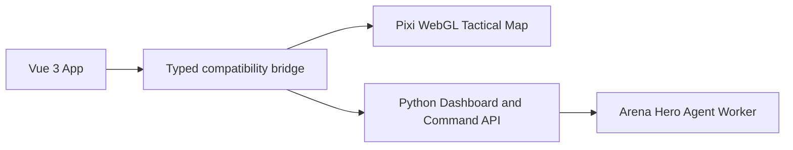

# Arena Hero Dashboard 前端架构

## 技术栈

Dashboard 使用 Vue 3、TypeScript 和 Vite 构建。Python 进程仍是 Agent Worker
和 Dashboard API 的宿主，不改变 Arena Hero 官方 SDK 的 WebSocket 接收、当前
Tick 决策和计划提交边界。



## 功能边界

Vue 应用由 `App.vue` 和六个页面 SFC 组成：`CommandHeader`、`RosterPanel`、
`TacticalMapPanel`、`SituationPanel`、`EventDrawer` 和 `ReplayPanel`。共享的
`DashboardStore` 负责轮询、回放、认证、命令版本和跨面板选择状态；组件只通过
composable 读写状态，保持以下功能：

`src/api/client.ts` 集中定义 Dashboard、事件、回放、地图记忆和命令的 TypeScript
响应边界；所有写命令统一经过会话、CSRF、版本和幂等键流程。Pixi 地图引擎位于
`src/map/engine/`，由 `useTacticalMap` 管理其生命周期和交互回调。

- 实时 Dashboard、单位筛选、单位详情和决策链。
- 战术编组、成员选择、编组展开与折叠。
- Pixi WebGL 战术地图、迷雾、视野、标注、缩放、平移、选点和移动路径。
- 回放时间轴、关键事件标记、播放、历史加载和实时跟随。
- 事件日志过滤、人工认证、任务排队、撤回、取消和地图下令。
- Core 迁移、策略姿态、策略参数热更新、迁移分析、矿区饱和度和命令审计。

浏览器只接收 Python `DashboardDataStore` 投影的脱敏字段，不接触 SDK `Turn`、
API Key、Cookie、原始对象标识或运行状态文件。人工命令仍必须经过会话、CSRF、
版本、幂等键和下一权威 Tick 的后端校验。

## 构建与托管

开发时可以使用 Vite Dev Server；它只代理请求，不会自动启动 Python
服务，操作者需要先按项目运行方式启动 Dashboard API：

```bash
cd frontend
pnpm dev
```

开发页面地址是 `http://localhost:5173/static/app/`。Vite 的 `/api` 和旧版
`/static` 资源请求会代理到 `http://127.0.0.1:8787`，`/static/app/` 保留给
Vue 开发页面本身，避免被旧资源代理规则拦截。

构建生产资源：

```bash
cd frontend
pnpm install
pnpm typecheck
pnpm build
```

Vite 使用 `/static/app/` 作为资源前缀，并将构建结果写入
`arena_tactic/web/static/app/`。Python 服务的 `/` 路由返回构建后的 `index.html`，
旧的内嵌页面、旧控制器和旧地图静态副本已经移除；唯一保留的 `/static/pixi.min.js`
是地图引擎所需的本地 vendor 资源。

`arena_tactic/web/static/app/` 是本地构建产物，已加入 Git 忽略。直接执行
`python3 tactic.py` 时，后端会先检查 `index.html`；缺失时使用本机 `pnpm` 安装锁定
依赖（仅在 `node_modules/` 不存在时）并执行 `pnpm build`，构建失败则不会继续启动
真实服务。Docker 镜像构建阶段会自动生成其运行时需要的 Vue 资源。

## 开发验证

```bash
cd frontend
pnpm typecheck
pnpm build
pnpm test:contract

cd ..
.venv/bin/python -m pytest -q
git diff --check
```

本项目不会由开发命令自动启动战术服务。完成构建后，由操作者按需启动服务，
再访问 `http://127.0.0.1:8787/` 验证浏览器渲染、实时轮询和人工命令链路。
