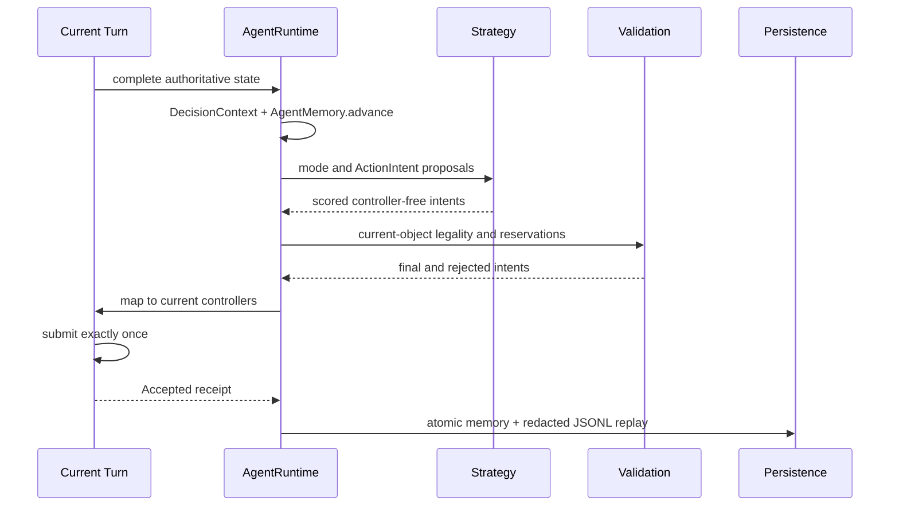

# Arena Hero 运行、记忆、回放与测试

## 1. 每 Tick 数据流



`tactic.py` 只负责 API Key 加载、官方同步 SDK 循环、一次提交、成功提交后的持久化和 `Ctrl-C` 退出。`choose_actions(turn)` 是离线兼容入口：它生成并映射计划，但不连接网络、不提交、不写磁盘。

## 2. 决策对象

- `DecisionContext` 是不可变的当前 Turn 快照，包含 Core、己方 Unit、当前可见敌人、资源、障碍、Beacon、占用索引、容量和上 Tick 事件。
- `ActionIntent` 不持有 SDK Controller，只保存当前对象 UUID、动作、目标、评分、原因、预计成本和预留格。
- `DecisionResult` 保存模式、最终意图、被拒意图、动作统计、等待原因、耗时、超时标志和下一版记忆。
- `AgentMemory` 不保存敌人或 Controller。当前 Turn 会完整覆盖旧的实体和资源事实。

## 3. 记忆与事件

默认记忆文件是 `runtime/agent-state.json`，目录被 `.gitignore` 忽略。状态包含版本号、最后 Tick、模式迟滞、连续无资源 Tick、永久障碍、带到期 Tick 的临时失败格、已探索格、资源观察、Unit 任务、已处理事件 ID 和脱敏计数。v2 加载器会自动迁移旧的 v1 状态。

事件按 `event_id` 去重。资源耗尽或成功采集会淘汰旧资源观察；移动失败会读取上一计划保存的实际下一格，普通失败将其冷却 4 Tick，地形阻挡将其记录为永久障碍，并让探索任务轮换扇区；存入失败会清理对应 Unit 任务；Core 重生会清空旧 Unit 任务。生产、治疗、射击、移动和重生结果全部进入事件计数，下一 Turn 的完整状态仍是事实来源。

只有服务器返回 `accepted=true` 后，`AgentRuntime.commit()` 才通过同目录临时文件与 `os.replace()` 原子保存下一版记忆。进程在提交前退出不会提前推进持久状态。

## 4. 导航预算与降级

每 Tick 总决策预算默认 500ms。导航使用永久障碍、仍在冷却的失败格、当前敌人格和可选威胁格执行有界 A*，单次搜索最多展开 1500 个节点。资源目标按最短路径成本唯一分配；探索目标按稳定的东、南、西、北扇区和持久任务分配，并在每个扇区内先筛选最多 32 个几何候选再计算路径成本。

如果到达截止时间或搜索未找到路径，Agent 立即按剩余距离、UUID 和方向稳定排序选择当前安全相邻格。统一校验器再次检查障碍、敌方占用、当前攻击目标和每格最多两个己方实体；被拒动作变为带原因的安全 `WAIT`。

## 5. 脱敏观测与离线指标

标准输出每 Tick 只有一行 JSON 摘要：Tick、模式、资源、人口、动作计数、等待原因、决策耗时、超时和提交结果。

成功提交后追加 `runtime/replay.jsonl`。回放包含当前可见状态、事件白名单数值、最终/拒绝意图和耗时；用户名被省略，UUID 使用不可逆短哈希别名，API Key、Cookie 和 Authorization 不进入结构。`replay_metrics(path)` 可统计 Tick 数、接受率、超时数、模式/动作分布、资源变化、最大人口、Core 缺失/受损 Tick、Beacon 持有 Tick，以及平均和最大决策耗时。截断的最后一行会被安全跳过。

## 6. 离线验证

```bash
source .venv/bin/activate
python3 -m compileall -q tactic.py arena_tactic tests
python3 -m pip check
python3 -m pytest -q
PYTHONPATH=.agents/skills/arena-hero python3 -m pytest -q .agents/skills/arena-hero/tests
git diff --check
```

测试覆盖模式切换与迟滞、治疗与生产预算、Ranger/Vanguard 评分、视野 integer-supercover、Ranger 中间射击格、A* 绕障、四扇区探索、目标持久化、失败格冷却、地形障碍学习、资源唯一分配、两实体容量、UUID 决胜、当前目标校验、事件去重、资源枯竭与补充、连续移动失败、敌 Core 突现、Core 受损、Beacon 掉落、原子记忆、脱敏回放、确定性属性和 20 Unit 性能。

这些结果仅证明本地语法、依赖和代表性官方 SDK 状态的行为。它们不证明 API Key 有效、网络可达、服务器接受计划或真实策略收益。

## 7. 实时运行边界

前台调试只有用户明确要求时才运行：

```bash
source .venv/bin/activate
python3 tactic.py
```

24 小时运行使用项目根目录的 Docker Compose 服务：

```bash
docker compose up -d --build
curl http://127.0.0.1:8787/livez
curl http://127.0.0.1:8787/healthz
docker compose logs -f --tail=100 arena-hero
```

容器负责进程重启，`tactic.py` 负责 SDK 流关闭后的重连，`/livez` 表示
进程仍在运行，`/healthz` 表示最近已收到 Arena Hero 的 Turn。实时验证应
单独报告安装的 SDK 版本、收到的首个 Turn、提交结果和非敏感事件；不得输出
密钥、Cookie 或 Authorization Header。
