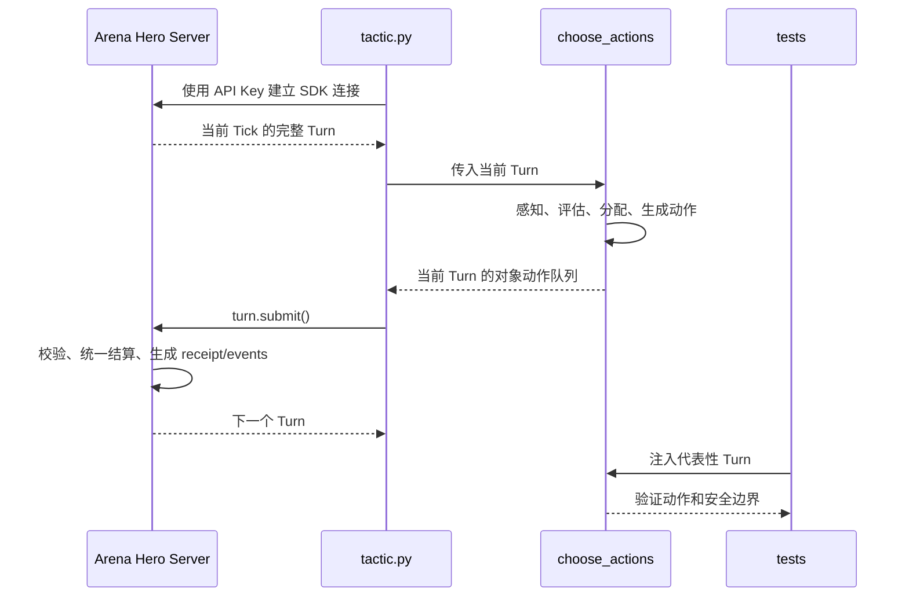
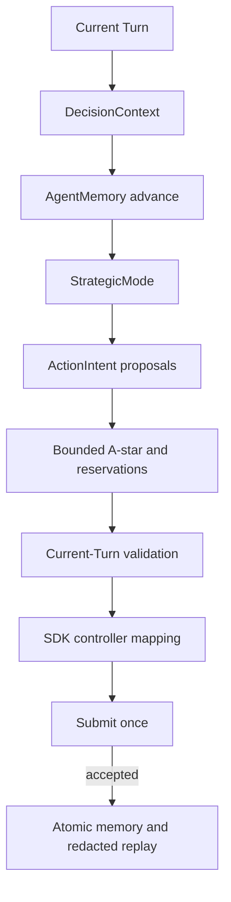
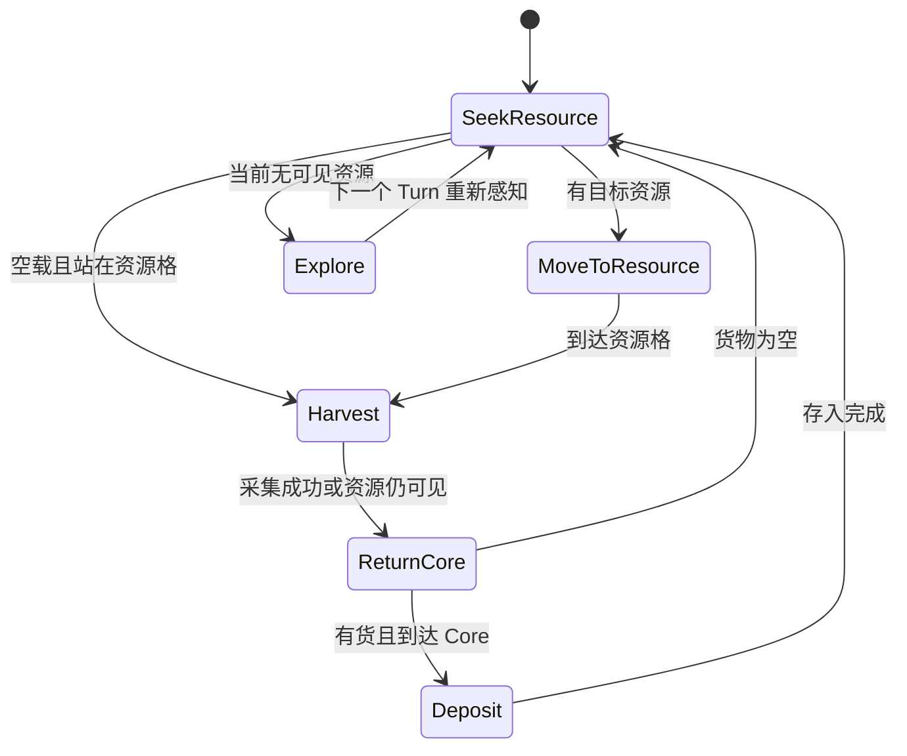

# Arena Hero Tactic 设计文档

## 1. 文档目的

本文档定义本项目 Arena Hero Tactic 的定位、运行边界、决策架构、动作生成规则、异常处理、测试策略和演进路线。

本文档描述当前已经落地的自适应 Agent 总体架构。具体阈值和模式切换见
[`arena-hero-strategy.md`](arena-hero-strategy.md)，运行、持久化、回放和验证见
[`arena-hero-runtime-testing.md`](arena-hero-runtime-testing.md)。代码行为最终以
`arena_tactic/`、`tactic.py` 和 `tests/` 为准。

本项目不把 Python 代码部署到 Arena Hero 官方服务器。程序在本地运行，通过官方 `arena-hero` Python SDK 接收当前 `Turn`，在本地计算行动，再把当前 Tick 的计划提交给服务器。

## 2. 产品定位

Arena Hero 是一个共享持久二维世界中的 Agent 策略竞技环境。每个玩家拥有一个 Core 和若干 Unit，在有限的 Tick 指令窗口内完成资源采集、生产、移动、Beacon 争夺和战斗。

本项目的产品目标是提供一个可以持续连接实时世界、基于当前权威状态稳定提交合法计划的 Python Agent。第一阶段目标不是追求最优博弈，而是做到：

1. 不提交过期 Tick 的计划。
2. 不伪造对象 ID、坐标、资源或敌人。
3. 在可用时间内为当前可控对象提交一个完整且保守的计划。
4. 在没有 Core、连接中断或状态不完整时安全等待。
5. 所有决策均可通过纯函数或代表性状态测试验证。

## 3. 运行模型



`game.turns()` 是实时状态流，`choose_actions(turn)` 是本地决策核心，`turn.submit()` 是唯一的计划提交点。每个 Tick 只处理一个当前 `Turn`，不缓存旧 Tick 的控制器作为下一 Tick 的动作目标。

官方当前协议包含全局约 15 秒的指令窗口；收到状态后剩余时间可能已经减少。因此决策算法必须有明确的时间上限，优先提交简单合法计划，不能为了搜索最优解而错过窗口。

## 4. 系统边界

### 4.1 本项目负责

- 读取环境变量或项目 `.env` 中的 API Key。
- 使用官方 `ArenaHeroClient` 连接服务。
- 消费当前 `Turn`。
- 根据可见敌人、资源、障碍、己方 Core 和 Unit 生成动作。
- 每个 Tick 提交一次当前 Agent 计划。
- 对决策辅助函数进行离线测试。
- 输出不包含密钥的连接和提交结果摘要。

### 4.2 本项目不负责

- 实现 HTTP、WebSocket、重试、receipt 或状态模型。
- 修改官方 SDK 或绕过 SDK 的状态校验。
- 伪造不可见对象、隐藏资源数量、敌方 Unit 所有者或未来坐标。
- 自动启动服务、后台守护进程或浏览器。
- 将代码上传为服务器端脚本。
- 在没有用户明确要求时启动实时对局。

## 5. 当前目录与模块职责

| 路径 | 当前职责 |
| --- | --- |
| `tactic.py` | API Key 加载、SDK Turn 循环、单次提交、成功后持久化和安全退出 |
| `arena_tactic/context.py` | 从当前 Turn 构建不可变 `DecisionContext`，还原受障碍遮挡的可见格 |
| `arena_tactic/memory.py` | `AgentMemory`、事件去重、资源失效、探索记忆和原子 JSON 写入 |
| `arena_tactic/navigation.py` | 有界 A*、路径成本、威胁格和确定性超时回退 |
| `arena_tactic/strategy.py` | 模式选择、评分、阵容、Unit 与 Core 候选意图 |
| `arena_tactic/validation.py` | 当前对象、动作能力、攻击目标、资源条件和格子容量校验 |
| `arena_tactic/allocator.py` | 将校验后的意图映射到当前 Turn 的 SDK Controller |
| `arena_tactic/observability.py` | 脱敏摘要、JSONL 回放和离线指标 |
| `tests/` | 策略、导航、合同、属性、回放和性能测试 |
| `runtime/` | 被 Git 忽略的记忆与脱敏回放文件，首次成功提交后创建 |

## 6. 决策架构

### 6.1 当前结构

当前采用“模式状态机 + 分层优先级 + 评分候选 + 统一校验”的结构，不引入行为树框架。



各层职责如下：

1. **State Adapter**：只读取官方 SDK 对象，整理距离、占用、可见敌人和资源位置等派生信息。
2. **Safety Gate**：处理 `turn.core is None`、Core 状态异常、空状态和不支持的对象类型。
3. **Strategic Context**：在重生、恢复、防守、经济、探索、Beacon 和进攻模式间切换。
4. **Threat Assessment**：按可见威胁、距离、目标生命值和己方火力评估战斗优先级。
5. **Economy Assessment**：选择资源目标、回收路径、Core 容量和生产预算。
6. **Unit Action Allocation**：为每个己方 Unit 最多分配一个当前 Tick 动作。
7. **Core Action Allocation**：为 Core 最多分配一个动作，并处理治疗、生产、移动或等待的互斥关系。
8. **Plan Validation**：检查动作是否来自当前 Turn、是否重复、是否包含伪造实体和明显违反本地安全规则。

### 6.2 何时采用行为树

行为树可以在后续出现以下需求时引入：

- 多个战略模式需要共享大量条件节点。
- 需要可视化编辑和运行时解释“为什么选择这个动作”。
- 单个 Unit 的行为分支超过数十个，并且分支需要稳定复用。

即使引入行为树，也应让行为树输出纯粹的候选意图，由统一的动作分配器解决单位冲突、Core 单动作限制和当前 Tick 计划完整性。行为树不能直接绕过当前 Turn 或缓存对象控制器。

## 7. 当前策略行为

当前 `choose_actions()` 会返回 `DecisionResult` 并把完整动作队列写入传入的当前 Turn。决策优先级是：生命周期安全、Core 紧急防御、治疗、Worker 存取、合法攻击、生产、Beacon、探索与安全迁移。

Agent 不绑定单一战斗流派。`RESPAWN`、`RECOVER`、`DEFEND`、`ECONOMY`、`EXPLORE`、`BEACON` 和 `ATTACK` 七种模式由当前权威状态与少量退出迟滞共同决定。记忆只保存永久障碍、带到期 Tick 的临时失败格、已探索格、资源观察、Unit 任务、事件 ID 和脱敏统计；历史敌人绝不用于当前攻击。

移动采用 500ms 总预算内的有界 A*，资源按最短路径成本唯一分配，终点容量最多两个己方实体。探索者按原始 UUID 稳定覆盖东、南、西、北扇区，保留边界目标并周期轮换；移动失败会冷却实际尝试格或学习永久地形。搜索超时会退化为确定性的当前安全相邻步。当前有收益且合法的采集、存入、治疗、攻击、生产、Beacon 或探索机会存在时，不允许无理由全体等待。

## 8. 官方规则映射

### 8.1 权威状态

- 每个 `Turn` 是完整权威快照，下一 Tick 不得复用上一 Tick 的控制器或假设对象仍在原地。
- 只使用当前可见的 `resource_cells`，不能把曾经见过的资源点当作永久存在。
- 敌方 Unit 只在当前可见范围内参与决策。
- 障碍是永久地形；资源点和 Worker 掉落货物是可消耗状态。

### 8.2 动作限制

- 每个受控对象每 Tick 最多一个动作。
- Core 每 Tick 最多一个 Core 动作。
- 先排 Unit 动作，再排 Core 动作，最后一次提交完整计划。
- 不为出生 Tick 的新 Unit 追加假设动作。
- Ranger 使用官方 `SHOOT` 行为和 SDK 方法，不自行构造攻击协议。

### 8.3 经济约束

- Core 容量按 `max(10, population * 5)` 处理。
- Worker 只能在同一格的己方正常 Core 处存入资源。
- Worker 货物数量和自然资源剩余量不能由 Agent 猜测。
- 生产成本应优先使用 SDK 的 `unit_cost()` 或服务器 receipt 中的权威结果。
- 规划牺牲 Unit、暴露 Core 或接敌前，应考虑人口下降带来的 Core 容量变化。

### 8.4 战斗和恢复

- 移动先结算，战斗使用同一 Tick 的不可变战斗快照。
- 伤害同时应用，不依赖请求到达顺序作为先手。
- Ranger 只受障碍阻挡，不能假设其他 Unit 或 Core 会阻挡射线。
- Unit 治疗需要存活、与己方静止 Core 同格，并在战斗后结算。
- Core 被摧毁后，Unit、库存和 Beacon 的处理必须以服务器事件为准；不能把重生当作保留原对象 ID。

## 9. 目标选择与动作分配

### 9.1 威胁评分

目标评分可以从以下因素构成：

```text
threat_score =
    immediate_damage
  + core_attack_value
  + distance_pressure
  + target_vulnerability
  - movement_cost
```

评分只使用当前 Turn 中可见且可验证的数据。不可见敌人不得因为历史位置或推测位置而生成攻击动作。

### 9.2 Worker 任务分配

Worker 的基础状态机为：



若收到 `RESOURCE_DEPLETED` 或当前状态不再包含目标资源，应立即放弃旧目标并重新选择，不应继续向过期坐标移动。

当当前 Turn 没有可见资源时，空载 Worker 优先重新侦察未被当前视野证伪的资源观察坐标，否则按稳定分配的东、南、西、北扇区前往未探索边界。目标跨 Tick 保留，6 Tick 后顺时针轮换；失败后避开实际尝试格并立即换扇区。历史资源坐标只能生成移动，不能生成采集。完整视野由各己方对象的 Manhattan 半径并集和整数 supercover 遮挡计算，已进入当前视野但消失的资源立即失效。

### 9.3 战斗 Unit 分配

- Ranger：优先攻击可在当前射程和射线内验证的敌方 Core 或低生命值 Unit。
- Vanguard：优先靠近高价值敌人，在相邻时使用横扫；没有安全接敌条件时等待或移动。
- Worker：默认不参与战斗，除非撤退、Beacon 或资源回收目标改变了其任务。

## 10. 失败处理与恢复

### 10.1 连接失败

- API Key 缺失时停止并提示本地配置问题，不打印密钥。
- WebSocket 或 SDK 协议错误时先检查官方 SDK 版本，再检查端点和网络。
- 不通过放宽 Pydantic 校验、修改 site-packages 或丢弃未知字段来规避协议不匹配。

### 10.2 状态异常

- `turn.core is None`：本 Tick 不创建任何 Core 或 Unit 动作，等待下一个权威状态。
- Core 处于恢复或迁移状态：只生成该状态允许的动作，不能假设它可以生产、存储或治疗。
- 对象已从当前 Turn 消失：丢弃对应控制器和目标，不重试旧对象。

### 10.3 提交失败

- 不自动把旧计划重提交到新 Tick。
- 记录不含凭据的错误类型和 Tick 标识。
- 若当前 Tick 已错过窗口，等待 SDK 提供的下一个完整 Turn。
- 对动态失败以服务器 receipt/events 为准，并更新下一 Tick 的目标。

### 10.4 进程退出

- 支持 `Ctrl-C` 干净退出 SDK 上下文。
- 不启动后台服务，不创建无法手动停止的守护进程。
- 退出后由用户重新启动脚本；本项目第一阶段不做服务管理器或自动拉起。

## 11. 可观测性与安全

允许记录：

- 当前 Tick 编号。
- `accepted` 结果。
- 各类动作计数，例如移动、采集、射击、等待。
- 非敏感的 SDK 或协议错误类型。
- 下一 Tick 需要关注的事件类型。

禁止记录或提交：

- API Key、Cookie、Authorization Header。
- `.env` 内容。
- 未脱敏的认证请求。
- 超出必要范围的敌方隐私信息。

建议后续增加结构化日志，但必须默认关闭敏感字段，并通过 `.gitignore` 排除本地日志和运行时 JSON。

## 12. 测试设计

### 12.1 单元测试

应覆盖：

- Manhattan 距离和方向选择。
- 遇到障碍时的移动方向选择。
- 资源为空时 Worker 不生成采集动作。
- 无可见资源时探索者稳定覆盖东、南、西、北四个扇区，目标不会逐 Tick 漂移。
- 探索者按周期轮换扇区；移动失败后冷却实际尝试格，下一 Tick 不立即反向摆动或再次撞向同一格。
- 四个相邻格都不可用时才等待。
- 有货 Worker 优先回 Core。
- Ranger 只对当前可见、合法射程目标生成攻击。
- Vanguard 只在相邻敌人存在时横扫。
- Core 缺失时不生成伪造动作。
- 每个对象最多一个动作，Core 最多一个动作。

### 12.2 合同测试

合同测试使用官方 SDK 的代表性 Turn 或模型构造数据，验证：

- 依赖的字段名与枚举值和 SDK 一致。
- `resource_cells`、`visible_enemies`、`obstacle_cells` 的读取方式稳定。
- Unit HP、Core 状态和人口字段可以正确参与决策。
- 提交接口只在连接层调用，纯策略函数不产生网络副作用。

### 12.3 静态和依赖检查

```bash
source .venv/bin/activate
python3 -m compileall -q tactic.py arena_tactic tests
python3 -m pip check
python3 -m pytest -q
git diff --check
```

这些检查只能证明代码语法、依赖和离线测试范围内没有问题，不能证明官方服务器可连接、API Key 有效或实时对局已成功运行。

### 12.4 实时验证

实时验证必须由用户明确要求后执行。验证时应单独记录：

- 使用的 SDK 版本。
- 是否建立连接并收到第一个 Turn。
- 提交成功、跳过、错过窗口的 Tick 数量。
- 服务器返回的非敏感 receipt/events。

实时验证期间不修改策略代码、不升级依赖、不启动额外后台服务，除非用户另行授权。

## 13. 演进路线

### Phase 0：仓库与安全基线

- 初始化 Git。
- 保持 `.env`、`.venv`、缓存和运行时文件不被跟踪。
- 保留当前最小依赖和可离线测试入口。

### Phase 1：策略模块化（已完成）

- 把感知、威胁评估、Worker 任务、战斗分配和 Core 决策拆成纯函数。
- 引入不可变的 `DecisionContext` 和动作意图类型。
- 增加每个策略分支的代表性测试。

### Phase 2：可靠动作管线（已完成）

- 增加当前 Turn 标识和一次性提交保护。
- 在提交前执行本地计划完整性检查。
- 统一处理 receipt/events，淘汰过期资源和目标。

### Phase 3：战术能力（已完成首版）

- 障碍感知的短路径规划。
- 多 Worker 资源分配与回收优先级。
- Ranger 集火和 Vanguard 接敌撤退规则。
- Beacon 价值评估与风险控制。

### Phase 4：战略能力（已完成首版）

- 发展、防守、进攻、恢复、Beacon 争夺状态机。
- 基于历史事件的有限记忆，但不把记忆当作当前权威状态。
- 资源预算、人口上限和 Core 安全距离的多 Tick 规划。

### Phase 5：评估与调参（基础设施已完成，等待真实数据）

- 保存脱敏 Turn/receipt 回放样本。
- 建立离线回放评估：资源净增长、Unit 存活率、Core 受伤率、Beacon 持有时间、提交成功率。
- 只有在离线回放稳定后才进行实时验证。

## 14. 设计决策记录

### ADR-001：使用本地长连接 Agent

**决定**：采用本地 `tactic.py` + 官方 SDK 的持续连接模式。

**原因**：符合当前仓库结构，保留完整 Python 测试能力，避免把策略逻辑和官方服务器部署机制混在一起。

**代价**：本地进程停止或网络断开后无法继续提交行动；需要诚实处理漏 Tick。

### ADR-002：先使用分层优先级，不引入行为树框架

**决定**：当前阶段使用显式优先级和纯函数，行为树作为后续可选演进。

**原因**：当前单位类型和动作集合较小，优先保证合法性、时限和可测试性。

**代价**：随着策略复杂度上升，条件可能变多；届时需要引入状态机、效用评分或行为树来管理复杂度。

### ADR-003：服务器状态优先于本地记忆

**决定**：当前 Turn 覆盖旧的实体和资源事实，本地记忆只作为可丢弃的历史上下文。

**原因**：资源会被其他玩家消耗，敌人会移动，Core 和 Unit 可能在同一 Tick 被摧毁或重生。

**代价**：历史资源只能作为重新侦察提示，敌人完全不持久化；这会放弃部分预测收益，但保证当前攻击与采集动作可验证。

## 15. 外部规则参考

- [Arena Hero Source and Version Policy](https://doc.arenahero.io/reference/source-and-version)
- [World and Ticks](https://doc.arenahero.io/rules/world-and-ticks)
- [Map and Vision](https://doc.arenahero.io/rules/map-and-vision)
- [Core and Economy](https://doc.arenahero.io/rules/core-and-economy)
- [Units](https://doc.arenahero.io/rules/units)
- [Combat](https://doc.arenahero.io/rules/combat)
- [Destruction and Respawn](https://doc.arenahero.io/rules/destruction-and-respawn)

官方规则或 SDK 版本升级后，应先重新核对这些参考，再修改策略、测试和本文档。
